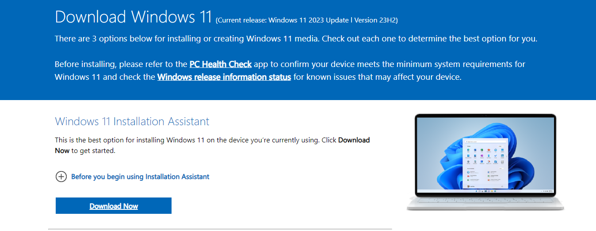
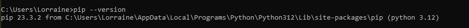

[](https://classroom.github.com/a/vbnbTt5m)
[](https://classroom.github.com/online_ide?assignment_repo_id=15243774&assignment_repo_type=AssignmentRepo)
# Dev_Setup
Setup Development Environment

#Assignment: Setting Up Your Developer Environment

#Objective:
This assignment aims to familiarize you with the tools and configurations necessary to set up an efficient developer environment for software engineering projects. Completing this assignment will give you the skills required to set up a robust and productive workspace conducive to coding, debugging, version control, and collaboration.

#Tasks:

## 1. Select Your Operating System (OS):
   ### Choose an operating system that best suits your preferences and project requirements. Download and Install Windows 11. https://www.microsoft.com/software-download/windows11

- Visit Microsoft's Windows 11 download page.
- Download the Windows 11 Installation Assistant.
- Follow the on-screen instructions to install Windows 11 on your machine.

### Screenshots:
- Windows installation page
 

- Windows installed in my system


## 2. Install a Text Editor or Integrated Development Environment (IDE):
   ### Select and install a text editor or IDE suitable for your programming languages and workflow. Download and Install Visual Studio Code. https://code.visualstudio.com/Download

- Visit the Visual Studio Code download page.


- Click the download button for Windows to get the installer VSCodeUserSetup-x64-<version>.exe.

- Run the downloaded installer and follow the prompts:
     - Accept the agreement.
     - Choose the installation location.
     - Select additional tasks (create a desktop icon, add to PATH, etc.).
     

- Complete the installation and launch Visual Studio Code.


## 3. Set Up Version Control System:
   ### Install Git and configure it on your local machine. Create a GitHub account for hosting your repositories. Initialize a Git repository for your project and make your first commit. https://github.com

- Download Git from the official website.


- Run the installer Git-<version>-64-bit.exe and follow the prompts:
     - Choose the default editor used by Git (select Visual Studio Code).
     - Adjust your PATH environment.

     

- Complete the installation.


- Open Git Bash or Command Prompt.
Set your username and email:

``` 
git config --global user.name "Your Name"

git config --global user.email "youremail@example.com"
```

- Visit GitHub and click on "Sign up".

- Follow the steps to create a new account.


- Open VS Code and create a new project folder.

Open the terminal in VS Code (Ctrl+`)
Run the following commands:
```
git init
echo "# Project Title" >> README.md
git add .
git commit -m "Initial commit"
```
Push to GitHub:
```
git remote add origin <your-repository-url>
git push -u origin master
```
- Screenshot of repo created with necessary files


## 4. Install Necessary Programming Languages and Runtimes:
  ### Install Python from http://wwww.python.org programming language required for your project and install their respective compilers, interpreters, or runtimes. Ensure you have the necessary tools to build and execute your code.

- Visit Python's official website and click on "Download Python <version>".


- Run the installer python-<version>.exe and ensure "Add Python to PATH" is checked.


- Click "Install Now" and follow the prompts to complete the installation.

Verify the installation by running:
```
python --version
```


## 5. Install Package Managers:
   ### If applicable, install package managers like pip (Python).

- Pip is installed with Python by default. Verify by running:

```
pip --version
```


## 6. Configure a Database (MySQL):
   ### Download and install MySQL database. https://dev.mysql.com/downloads/windows/installer/5.7.html
   
- Visit the MySQL download page.

- Download and run the installer mysql-installer-community-<version>.msi.


- Follow the setup wizard:
    - Choose "Custom" setup type.
    - Select MySQL server and MySQL Workbench.
    - Follow the prompts to install the selected products.

- Configure MySQL server (set root password, choose default settings).

- Complete the installation and launch MySQL Workbench.


7. Set Up Development Environments and Virtualization (Optional):
   Consider using virtualization tools like Docker or virtual machines to isolate project dependencies and ensure consistent environments across different machines.

## 8. Explore Extensions and Plugins:
   ### Explore available extensions, plugins, and add-ons for your chosen text editor or IDE to enhance functionality, such as syntax highlighting, linting, code formatting, and version control integration.

- Open VS Code and go to the Extensions view by clicking the Extensions icon in the Activity Bar or pressing Ctrl+Shift+X.

- Search for and install recommended extensions.


- Configure the extensions as necessary.

## Reflection

During the setup process, a few challenges were encountered, such as installing MySQL and configuring it properly. The initial installation process was straightforward, but setting up the MySQL server and MySQL Workbench required careful attention to detail. Specific challenges included configuring the root password and ensuring the MySQL server was running correctly. These challenges were resolved by meticulously following official MySQL documentation and using community guides to troubleshoot any issues. Double-checking each step and verifying the installation via MySQL Workbench and the command line ensured that MySQL was set up correctly.

9. Document Your Setup:
    Create a comprehensive document outlining the steps you've taken to set up your developer environment. Include any configurations, customizations, or troubleshooting steps encountered during the process. 

### Deliverables:
- Document detailing the setup process with step-by-step instructions and screenshots where necessary. -> Done
- A GitHub repository containing a sample project initialized with Git and any necessary configuration files (e.g., .gitignore). -> Done
- A reflection on the challenges faced during setup and strategies employed to overcome them.

## Submission:
Submit your document and GitHub repository link through the designated platform or email to the instructor by the specified deadline.

### Evaluation Criteria:
- Completeness and accuracy of setup documentation.
- Effectiveness of version control implementation.
- Appropriateness of tools selected for the project requirements.
- Clarity of reflection on challenges and solutions encountered.
- Adherence to submission guidelines and deadlines.

Note: Feel free to reach out for clarification or assistance with any aspect of the assignment.
